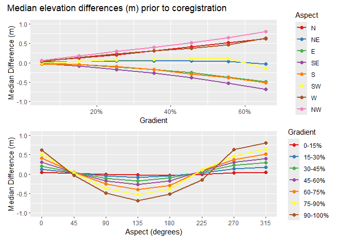
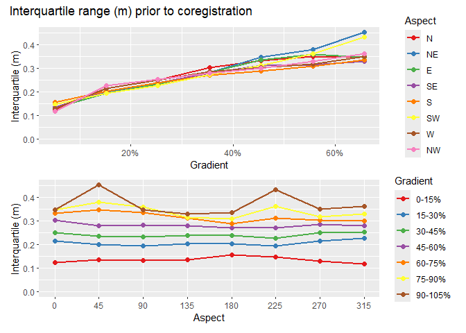
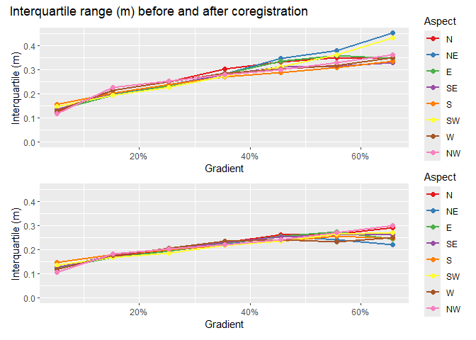
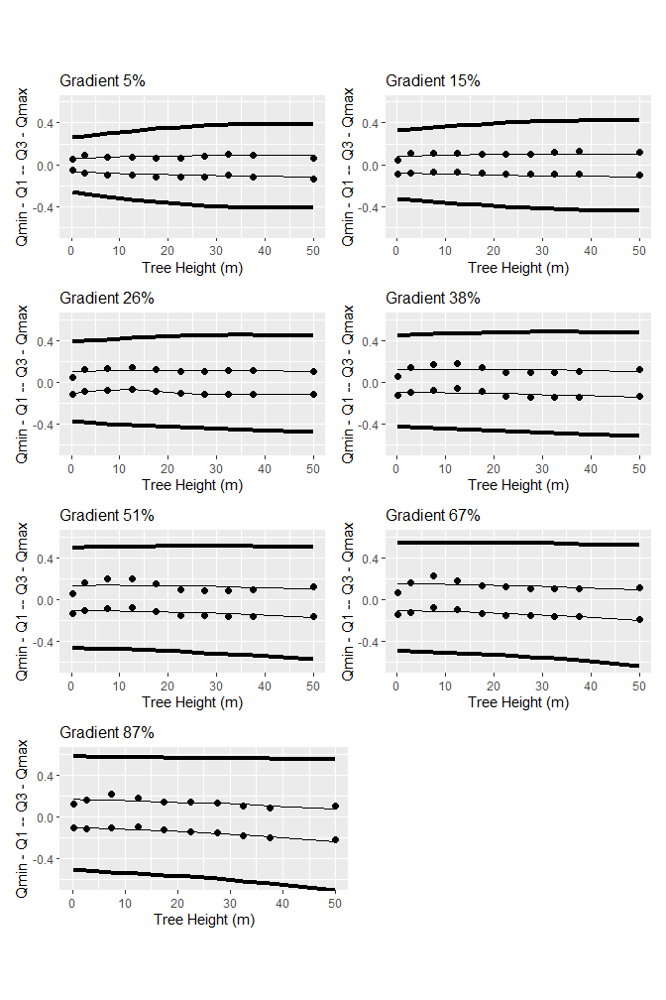

# Coregistration
Dan
2025-04-02

Our goal is to identify landslide sites using changes in ground-surface
elevation resolved between sequential lidar acquisitions. We want to
take advantage of raster-processing algorithms for image segmentation
and topographic analyses, so we would like to work with
elevation-difference rasters. In using lidar to detect elevation change,
it is necessary to ensure that the two data sets are aligned spatially.
Differences in spatial registration between the two data sets will
produce systematic errors in measured elevation differences. In the
study design, we described approaches that have been used for
co-registration of lidar datasets. These involve two strategies:

- Co-register the ground returns, then build DTMs.

- Co-register existing DTMs.

The first approach seems likely to be the more consistent of the two,
because consistent methods can be used for filtering ground returns from
the point clouds and for interpolation of the DTMs from the ground
returns. When using existing DTMs, e.g., those downloaded from the
[Washington Lidar Portal](https://lidarportal.dnr.wa.gov/), they may
have been generated with different point-filtering algorithms and
interpolation schemes. However, working with point clouds directly is
computationally intensive and time consuming. If we can obtain good
results with the existing DTMs, that will reduce time and computer
requirements dramatically (Li et al. 2023).

Consider two DTMs for the same site. One may be slightly shifted
horizontally and vertically from the other, and/or slightly tilted or
rotated. Over all or some portion of the DTMs, we can seek to shift and
rotate one so as to minimize differences with the other (D. Rosenholm
and Kennert Torlegard 1988). We assume that, over the spatial extents of
aerial lidar acquisitions (as opposed to those of satellite-acquired
lidar), registration of the point clouds and derived surface models is
sufficiently accurate that differences in the tilt and rotation of the
coordinate systems is minimal. We focus on a linear displacement of one
DTM from the other by an amount $\Delta x, \Delta y, \Delta z$. Writing
the elevation difference between the two DTMs at a grid-point $i$ as
$\Delta e_i$, we can write the elevation difference as

$$
\Delta e_i = \frac{\partial{\Delta e_i}}{\partial{x_i}}\Delta x + \frac{\partial{\Delta e_i}}{\partial{y_i}}\Delta y + \frac{\partial{\Delta e_i}}{\partial{z_i}}\Delta z
 \qquad(1)$$

where $\frac{\partial{\Delta e_i}}{\partial{x_i}}$ is the partial
derivative of the elevation difference with respect to $x_i$, and
similarly for $y_i$ and $z_i$. For $n$ DTM grid points, we then have $n$
equations, each with a unique
$\Delta e_i, \frac{\partial{\Delta e_i}}{\partial{x_i}}$, and
$\frac{\partial{\Delta e_i}}{\partial{y_i}}$
($\frac{\partial{\Delta e_i}}{\partial{z_i}}$ is simply one) and with
single values for each of $\Delta x, \Delta y$, and $\Delta z$. We seek
the $\Delta x, \Delta y$, and $\Delta z$ that provide the best estimates
of all the $\Delta e_i$. We can treat this as a [linear least-squares
problem](https://en.wikipedia.org/wiki/Linear_least_squares). In matrix
notation, we seek to minimize
$||\boldsymbol{A}\boldsymbol{x} - \boldsymbol{b}||^2$ where
$\boldsymbol{A}$ is a 3 by $n$ matrix containing the partial
derivatives, $\boldsymbol{x}$ is a 3-element vector containing the the
$\Delta x, \Delta y$, and $\Delta z$ values, and $\boldsymbol{b}$ is an
$n$-element array containing the $\Delta e_i$.

Imagine, on an 80% slope, an offset of 0.5 meters between the two DTMs
would result in a $\Delta e$ of 0.4 meters. The partial derivatives
$\frac{\partial{\Delta e_i}}{\partial{x_i}}$ and
$\frac{\partial{\Delta e_i}}{\partial{y_i}}$ reflect the ground-surface
slope at point $i$ as resolved by the DTM. Each point lies at the corner
of four DTM cells, each cell is defined by four points. For any DTM
point, we can look at the elevations of the adjacent 8 points to
determine into which of the four adjacent cells we need to shift the
point to solve for $\Delta e$. We can estimate the elevation change with
a change in $x$ or $y$ within that cell using bilinear interpolation.
That gives a value for $\frac{\partial{\Delta e_i}}{\partial{x_i}}$ and
$\frac{\partial{\Delta e_i}}{\partial{y_i}}$. The value of
$\frac{\partial{\Delta e_i}}{\partial{z_i}}$ is simply 1.[^1]

For any overlapping portion of two DTMs, we can find an optimal set
$\Delta x, \Delta y$, and $\Delta z$. In doing this, we want to exclude
portions of the DTMs where elevation changes did occur. The $\Delta e$
values for those sites would not be a consequence of a shift in the
registration between the DTMs and including those in our set of
equations would bias the resulting estimates for $\Delta x, \Delta y$,
and $\Delta z$. Below I describe a method for differentiating systematic
errors and noise from the elevation changes we want to resolve.

We’ll use a portion of the Post-Mortem study area with overlap of the
2006 and 2007 lidar DTMs that contains several of the study blocks. The
study blocks are shown by the black polygons in the image below. The red
box outlines the analysis area.

Figure 1: Site location and area of analysis.

Overlap of the two DTMs is shown below with the elevation difference, in
quarter-meter increments, indicated by the colors.

The elevation differences are spatially variable with systematic biases
aligned with hillslope aspect. We can see this by binning the elevation
differences for each DTM grid point by increments in slope and aspect
and plotting [quartiles](https://en.wikipedia.org/wiki/Quartile). To
make the following plots, I first determined the quartiles for the full
range of elevation-difference values in each bin. I want to focus on
systematic errors and noise in the DTMs and exclude sites where
elevations did change, e.g., at landslide sites. To differentiate
between signal (actual elevation changes) and noise, I calculated the
interquartile range for all values, then used a [Tukey
fence](https://en.wikipedia.org/wiki/Outlier#Tukey's_fences) with $k$ =
1.5. Values less that $q1 - 1.5*(q3-q1)$ or greater than
$q3 + 1.5*(q3-q1)$ are considered likely
[outliers](https://en.wikipedia.org/wiki/Outlier). These potentially
indicate sites where elevations have changed between lidar acquisitions.
For each bin, I removed these potential outliers and recalculated the
quartiles to provide an estimate of the systematic bias and random error
in the elevation-difference values.

The calculations are performed by program Align.

<a href="#fig-medianErrorBefore" class="quarto-xref">Figure 2</a> shows
median elevation difference values across the range of hillslope
gradient and aspect increments. Deviations from zero indicate systematic
variations with gradient and aspect.

Figure 2: Median difference (m) in 2006 and 2017 DTM elevations prior to
coregistration, after removal of apparent outliers.

This systematic error is small for low-gradient terrain and increases
with slope steepness. For south-easterly aspects, the median error is
negative; for north-westerly aspects, the median error is positive, and
for south-west and north-east facing slopes, the median error remains
small. This indicates that the DTMs are shifted in a south-east to
north-west direction relative to each other.

We can use the [interquartile
range](https://en.wikipedia.org/wiki/Interquartile_range) as a measure
of the magnitude of random variability in the difference raster.

Figure 3: Interquartile range (m) of 2006 and 2017 DTM elevation
differencess prior to coregistration, after removal of apparent
outliers.

The interquartile range is relatively small for low-gradient terrain and
increases with slope steepness. This provides a characterization of the
noise in the elevation-difference raster obtained by subtracting the
2017 lidar DTM from the 2006 lidar DTM. Can we use these measurements to
constrain the elevation-threshold that distinguishes signal from noise?
Can we use $qmin = q1 - 1.5*(q3-q1)$ for the minimum $q1$ value as a
function of aspect and slope as a threshold for identifying sites where
elevations decreased between 2006 and 2017? Likewise, can we use
$qmax = q3 + 1.5*(q3-q1)$ for the maximum $q3$ value as a function of
aspect and slope as a threshold for identifying sites where elevations
increased between 2006 and 2017? These values provide slope-dependent
threshold within which we can identify sites where elevations likely did
not change.

Can we define a function of slope and aspect that reflects the behavior
observed in the graphs above? For a single aspect, we see that the
median error exhibits a slightly curved dependence with gradient. The
slope of that linear dependence varies with the sine of the aspect. This
agrees with what we expect if the two DTMs are offset horizontally.
Along the fall line, differences in elevation will be maximum; along a
contour, differences will be minimum. We define

$$\mu = \sin(A+\alpha)$$

where $A$ is the azimuth measured from north and $\alpha$ is the angular
shift so variation in $\mu$ aligns with that seen in
<a href="#fig-medianErrorBefore" class="quarto-xref">Figure 2</a>. Then
define a linear function of gradient with coefficients that vary with
$\mu$:

$$
qmin = (\beta_0 + \beta_1\mu) + (\beta_2 + \beta_3\mu)S + (\beta_4 + \beta_5 \mu)S^2
$$

where $S$ is slope gradient and the $\beta$ are empirical coefficients.
This defines an equation with seven coefficients, $\alpha$ and the six
$\beta$ values.

I solve for these coefficients as follows:

1.  Create a normalized set of curves for the variation of $q2$ as a
    function of aspect for each of the slope-gradient increments. The
    “normalized” curves vary from -1 to +1 over the range of aspects.
    The normalization is done as follows:
    1)  For each slope increment, find the maximum and minimum values of
        $q2$.
    2)  Define $qshift = -(qmax-qmin)*0.5$
    3)  Define $range = (qmax-qmin)*0.5$
    4)  Define $normq(abin,sbin) = (q2(abin,sbin) + qshift)/range$
2.  Find the value of $\alpha$ that minimizes the sum of squared
    residuals, i.e., find the value of $\alpha$ that minimizes
    $\sum_{i=1}^n(\sin(A_i+\alpha)-normq_i)^2$. This is done using
    Brent’s algorithm (see
    [people.match.sc.edu/Burkardt/f_src/brent/brent.f90](https://people.math.sc.edu/Burkardt/f_src/brent/brent.f90)).
3.  Define a set of linear equations  
    $$qmin_i = \beta min_0 + \beta min_1*mu_i + \beta min_2*S_i + \beta min_3*mu_i*S_i$$
    $$qmax_i = \beta max_0 + \beta max_1*mu_i + \beta max_2*S_i + \beta max_3*mu_i*S_i$$
    where $\mu_i = \sin(A_i+\alpha)$ and $A_i$ is the slope aspect and
    $S_i$ is slope gradient.
4.  Solve for the $\beta min$ and $\beta max$ values. This is done using
    the [LAPACK](https://en.wikipedia.org/wiki/LAPACK) routine DGELS.

Here are the resulting curves for the eight major slope aspects (N, NE,
E, SE, S, SW, W, and NW).

Figure 4: Hillslope gradient- and aspect-dependent level of detection
(LoD). The dots indicate calculated first and third quartiles for each
slope and aspect interval, the thin lines show the polynomial fit to
those points, and the thick lines show the Tukey’s fences using a k
value of 1.5.

The envelope contained within the thick black threshold curves defines
the elevation-difference values falling within the range of gradient-
and aspect-dependent systematic errors plus random variability present
in the difference raster. We use these thresholds to define the level of
detection (LoD, e.g., Lane, Westaway, and Murray Hicks 2003; Brasington,
Langham, and Rumsby 2003) to identify sites where there likely were
elevation changes during the time between the lidar acquisitions and
exclude these from the set of equations used to estimate the optimal
$\Delta x, \Delta y$, and $\Delta z$ values with
<a href="#eq-shifts" class="quarto-xref">Equation 1</a> above.

Note that these thresholds are not symmetric about zero. The median,
midway between the Q1 and Q3 curves, is near zero for low-gradient
terrain, but veers away from zero at steeper gradients by an amount that
varies with aspect. Shifting the 2017 DTM to minimize differences
between the two DTMs should eliminate that aspect dependence.

Here are results after coregistration.

Figure 5: Median difference (m) in 2006 and 2017 DTM elevations after
coregistration.

This procedure has greatly reduced the systematic differences. Let’s
look at the interquartile range, our measure of random error.

Figure 6: Interquartile range (m) of 2006 and 2017 DTM elevation
differences after coregistration.

Comparing before and after:

Figure 7: Median elevation differences (m) before and after
coregistration.

Figure 8: Interquartile range (m) before and after coregistration.

The random errors, as indicated by the interquartile range, have been
slightly reduced. Not what I was expecting. Here’s another look at the
before and after results.

    Warning: A numeric `legend.position` argument in `theme()` was deprecated in ggplot2
    3.5.0.
    ℹ Please use the `legend.position.inside` argument of `theme()` instead.

Figure 9: Density plots of median, mean, and interquartile range of
elevation differences before and after coregistration.

We’ve narrowed the range of median and mean values and shifted the
interquartiles to lower values. Here’s the elevation differences after
alignment:

We still see random noise, but the systematic errors aligned with slope
aspect are gone. Distinct changes are visible along many stream
channels. The final level of detection (LoD) used to delineate stable
terrain from areas where elevations changed between 2006 and 2017 is
shown with the curves in
<a href="#fig-curvesFinal" class="quarto-xref">Figure 10</a> below.

Figure 10: First and third quartiles (dots), polynomial fits (thin
lines), and limits using Tukey’s fences (k=1.5) after shifting the 2017
DTM.

The curves are now all symmetric about zero and the envelope defining
the LoD is narrower. Even so, the what we are interpeting as “noise” in
the DoD still spans a range of about ± 0.5m. What might be some causes
of this uncertainty?

## Canopy effects.

See <a href="#fig-canopy" class="quarto-xref">Figure 11</a> below. The
left panel shows elevation differences draped on a shaded relief image
for a portion of the overlapping 2006 and 2017 DTMs after
coregistration; the right panel shows an aerial photo view of the same
area. Over the low-gradient, low-relief, and unforested fields and
pastures, differences between the two DTMs are minor. Over the forested
hillslopes, the speckled pattern in the left panel indicates variability
in DTM elevations on the order of several tens of centimeters over
horizontal length scales of a few to ten meters, consistent with a
general reduction of lidar DTM accuracy observed over forested areas
(Simpson, Smith, and Wooster 2017).

Figure 11: The left panel shows differences in DTM elevations after
coregistration. The right panel shows an aerial photo view of the same
area.

There are two likely primary reasons for the increased variability over
forested areas (Petras et al. 2023):

1.  Increased spacing of lidar ground returns because of reflections
    from the forest canopy, and

2.  Interpretation of canopy reflections as ground returns.

The first of these is illustrated in
<a href="#fig-groundReturns" class="quarto-xref">Figure 12</a> below.

Figure 12: Left panel shows the number of lidar ground returns within
each cell of the 2006 DTM (3-foot DTM point spacing). Right panel zooms
into the area within the box of the left panel. Black dots indicate
ground returns.

Variation in ground-return spacing results in variable-sized gaps with
no returns and variable spatial density in the number of signals per DTM
cell. The bar chart in
<a href="#fig-barChart" class="quarto-xref">Figure 13</a> below shows
the proportion of all cells in the 2006 DTM that overlapped the 2017 DTM
containing a given number of ground returns.

Figure 13: Proportion of 2006 DTM cells with a given number of ground
returns

The variable spacing between ground returns results in variable lengths
over which elevations are interpolated to the DTM grid points.
Topographic detail between ground-return points is lost. The gaps in
ground return points will differ between the two DTMs. In rough terrain,
small features resolved in one DTM might thus be missed in the other,
resulting in differences in the interpolated ground elevations. A
variety of factors can result in variable lidar point spacing (Yan 2023;
Petras et al. 2023). For example, the systematic north-west to
south-east trending variations in point density visible in the left
panel may result from the extent of swath overlap between adjacent
flight lines as the lidar was collected. Random variations in point
density in forested areas may result from spatial variability in the
proportion of laser signals that penetrate through the tree canopy.
Additionally, some of the ground returns may actually be misinterpreted
reflections from tree canopy or understory vegetation, which introduces
random errors into the DTM elevations.

After coregistration of the 2006 and 2017 DTMs, we found that
variability in elevation differences, as measured by the interquartile
range (<a href="#fig-compareInter" class="quarto-xref">Figure 8</a>)
ranged from about 10 to 30 centimeters, increasing with increasing
hillslope gradient.
<a href="#fig-interquartileCanopy" class="quarto-xref">Figure 14</a>
below shows the same data, but here parsed by hillslope gradient and
tree-canopy height. Canopy height was determined in program Align after
shifting the 2017 DSM by subtracting the DTM elevation from the DSM
elevation at each grid point and using the maximum of the 2006 or 2017
canopy heights.

Figure 14: Variation of the interquartile range with changes in canopy
height and hillslope gradient.

Figure 15: The interquartile range and LoD (Tukey’s fences with k=1.5)
plotted as a function of canopy height for different increments in
hillslope gradient.

These show a minor increase with tree height at low gradients, but
little variation with tree height with increasing gradient. For now I am
saving incorporation of canopy height into our calculation of LoD for
the next iteration of program Align.

We are using the LoD defined by these graphs to identify “stable”
locations where elevations have probably not changed between the 2006
and 2017 lidar acquisitions. We used the elevation differences over
these stable locations to solve for the horizontal
($\Delta x, \Delta y$) and vertical ($\Delta z$) shifts needed to bring
the 2017 DTM into alignment with the 2006 DTM, using
<a href="#eq-shifts" class="quarto-xref">Equation 1</a>. The range
spanned by this LoD, ± 0.5m, is sufficient, however, to include things
like flood plain or fan agradation. Likewise, there may be systematic
biases in the random errors associated with lidar signal reflections
from vegetation interpreted as ground returns. A plantation that grows 2
meters over that 11 years may generate larger mean positive errors in
2017 DTM elevations than in 2006 DTM elevations, resulting in a positive
bias in elevation differences measured over that area. Likewise, an area
harvested between 2006 and 2017 will generate a negative bias. Aerially
extensive small changes in elevation and systematic changes in
vegetation height and density will affect the results we obtain in
solving <a href="#eq-shifts" class="quarto-xref">Equation 1</a>.
Currently, I do not know how to identify or remove those biases.

Next: identify landslide scars using the DoD.

Brasington, James, Joe Langham, and Barbara Rumsby. 2003.
“Methodological Sensitivity of Morphometric Estimates of Coarse Fluvial
Sediment Transport.” *Geomorphology* 53 (3-4): 299–316.
<https://doi.org/10.1016/S0169-555X(02)00320-3>.

D. Rosenholm, and Kennert Torlegard. 1988. “Three Dimensional Absolute
Orientation of Stereo Models Using Digital Elvation Models.”
*Photogrammetric Engineering and Remote Sensing* 54 (10): 1385–89.

Lane, Stuart N., Richard M. Westaway, and D. Murray Hicks. 2003.
“Estimation of Erosion and Deposition Volumes in a Large, Gravel-Bed,
Braided River Using Synoptic Remote Sensing.” *Earth Surface Processes
and Landforms: The Journal of the British Geomorphological Research
Group* 28 (3): 249–71.

Li, Tao, Yuanlin Hu, Bin Liu, Liming Jiang, Hansheng Wang, and Xiang
Shen. 2023. “Co-Registration and Residual Correction of Digital
Elevation Models: A Comparative Study.” *The Cryosphere* 17 (12):
5299–5316. <https://doi.org/10.5194/tc-17-5299-2023>.

Petras, V., A. Petrasova, J. B. McCarter, H. Mitasova, and R. K.
Meentemeyer. 2023. “Point Density Variations in Airborne Lidar Point
Clouds.” *Sensors (Basel)* 23 (3). <https://doi.org/10.3390/s23031593>.

Simpson, Jake, Thomas Smith, and Martin Wooster. 2017. “Assessment of
Errors Caused by Forest Vegetation Structure in Airborne LiDAR-Derived
DTMs.” *Remote Sensing* 9 (11): 1101.
<https://doi.org/10.3390/rs9111101>.

Yan, Wai Yeung. 2023. “Airborne Lidar Data Artifacts: What We Know Thus
Far.” *IEEE Geoscience and Remote Sensing Magazine* 11 (3): 21–45.
<https://doi.org/10.1109/MGRS.2023.3285261>.

[^1]: I found, however, that the vertical shift, $\Delta z$, varied
    nonlinearly with slope gradient.
    <a href="#eq-shifts" class="quarto-xref">Equation 1</a> was
    therefore modified to
    $\Delta e_i =\frac{\partial{\Delta e_i}}{\partial{x_i}}\Delta x + \frac{\partial{\Delta e_i}}{\partial{y_i}}\Delta y + \frac{\partial{\Delta e_i}}{\partial{z_i}}\Delta z + \beta_1 S_i + \beta_2 S_i^2$,
    where $S_i$ is the sine of the hillslope gradient for the $i^{th}$
    point and $\beta_1$ and $\beta_2$ are additional empirical
    coefficients.
