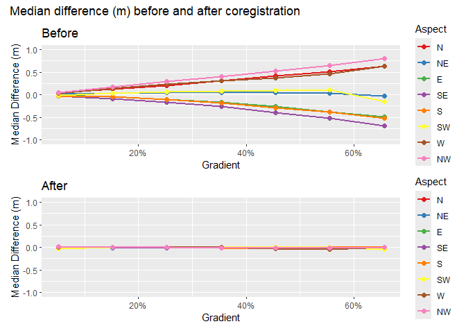
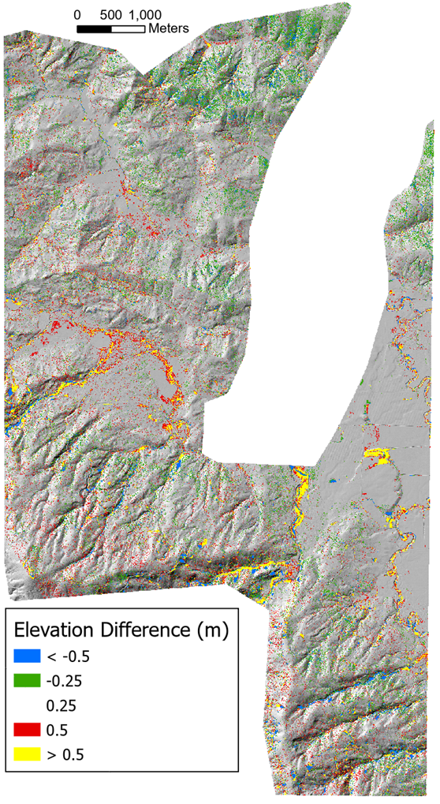
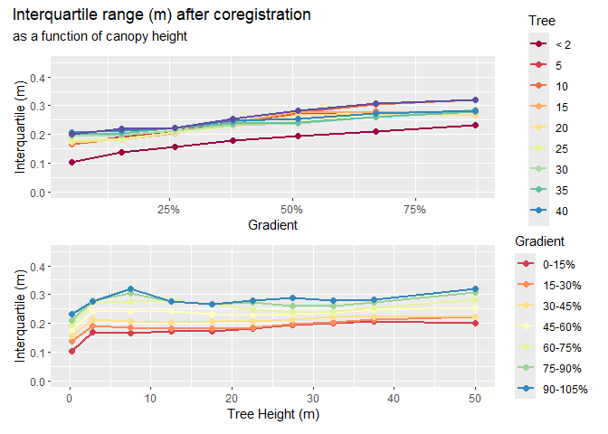
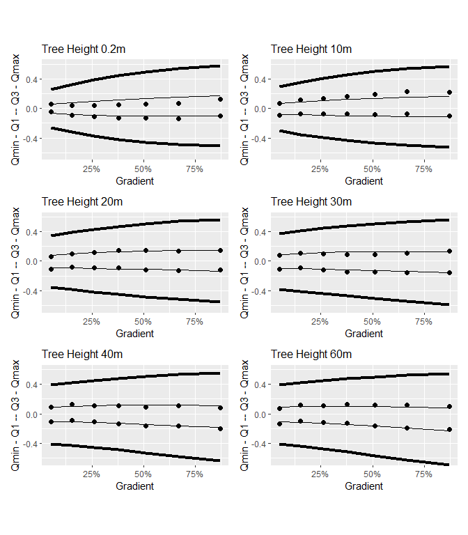

# Coregistration
Dan
2025-05-01

# Introduction

Our goal is to identify landslide sites using changes in ground-surface
elevation resolved between sequential aerial lidar acquisitions. We
could work with the lidar point clouds directly for this task, but we
would like to take advantage of raster-processing algorithms for image
segmentation and topographic analyses, so we want to evaluate the
potential of working with the raster DTMs derived from the lidar
point-cloud ground returns. Specifically, we here evaluate
elevation-difference rasters, referred to as “DEMs of Difference (DoDs)”
(R. D. Williams 2012). A DoD is obtained by subtracting one DTM[^1] from
another.

In using two (or more) lidar data sets to detect elevation change, it is
necessary to ensure that the data sets are spatially aligned (Cucchiaro
et al. 2020). Differences in spatial registration between the data sets
will produce systematic errors in measured elevation differences. In the
study design, we described approaches that have been used for
co-registration of lidar datasets. These involve two strategies:

- Co-register the lidar point-cloud ground returns, then build the two
  DTMs.

- Build the two DTMs, then coregister one DTM to align with the other.

The first approach seems likely to be the more consistent of the two,
because consistent methods can be used for filtering ground returns from
both point clouds and for interpolation of the DTMs from the ground
returns. When using existing DTMs, e.g., those downloaded from the
[Washington Lidar Portal](https://lidarportal.dnr.wa.gov/), they may
have been generated with different point-filtering algorithms and
interpolation schemes. However, working with point clouds directly is
computationally intensive and time consuming. If we can obtain good
results with the existing DTMs, that will reduce time and computer
requirements (Li et al. 2023).

Both approaches must address errors in the two lidar data sets. Besides
the systematic errors associated with differences in the spatial
registration of the point clouds and resulting DTMs, sources of error
include uncertainty in the elevation and location of each laser-signal
reflection represented by points in the point cloud, laser reflections
from vegetation interpreted as ground returns, and uncertainty as to
what the elevation is in between ground-return locations. These errors
and uncertainties carry through to a DTM built by interpolating from the
ground-return points to a DTM grid. The DoD obtained by subtracting one
DTM from another will include the combined effects of the errors and
uncertainties in both DTMs.

The magnitude of these errors and uncertainty affect the confidence we
can place in inferences made using the DTMs and the resulting DoD. We
need to account for this uncertainty when coregistering one DTM to the
other and when mapping landslide scars and deposits using the DoD. A
common way to account for this uncertainty is by determining a “minimum
level of detection” (LoD) (e.g., Wheaton et al. 2010). The LoD is
generally set so that we can assume a specified level of confidence that
DoD values greater than the LoD represent actual changes in
ground-surface elevation. Differences less than the LoD fall within the
range of inherent noise in the DoD and may or may not represent true
changes in ground elevation.

In the next sections we describe a method for estimating an LoD value
and using it to guide co-registration of the two DTMs and identification
of landslide scars and deposits.

# Coregistration

Consider two DTMs for the same site. One may be slightly shifted
horizontally and vertically from the other, and/or slightly tilted or
rotated. Over all or some portion of the DTMs, we can seek to shift and
rotate one so as to minimize differences with the other (D. Rosenholm
and Kennert Torlegard 1988). We assume that, over the spatial extents of
aerial lidar acquisitions (as opposed to those of satellite-acquired
lidar), registration of the point clouds and derived surface models is
sufficiently accurate that differences in the tilt and rotation of the
coordinate systems is minimal. We focus on a linear displacement of one
DTM from the other by an amount $\Delta x, \Delta y, \Delta z$. We
express the elevation difference $\Delta e_i$ between the two DTMs at a
grid-point $i$ as

$$
\Delta e_i = \frac{\partial{\Delta e_i}}{\partial{x_i}}\Delta x + \frac{\partial{\Delta e_i}}{\partial{y_i}}\Delta y + \frac{\partial{\Delta e_i}}{\partial{z_i}}\Delta z
 \qquad(1)$$

where $\frac{\partial{\Delta e_i}}{\partial{x_i}}$ is the partial
derivative of the elevation difference with respect to $x_i$, and
similarly for $y_i$ and $z_i$. For $n$ DTM grid points, we then have $n$
equations, each with a unique
$\Delta e_i, \frac{\partial{\Delta e_i}}{\partial{x_i}}$, and
$\frac{\partial{\Delta e_i}}{\partial{y_i}}$ (the value of
$\frac{\partial{\Delta e_i}}{\partial{z_i}}$ is simply 1) and with
single values for each of $\Delta x, \Delta y$, and $\Delta z$. We seek
the $\Delta x, \Delta y$, and $\Delta z$ values that provide the best
estimates of all the $\Delta e_i$. We can treat this as a [linear
least-squares
problem](https://en.wikipedia.org/wiki/Linear_least_squares). In matrix
notation, we seek to minimize
$||\boldsymbol{A}\boldsymbol{x} - \boldsymbol{b}||^2$ where
$\boldsymbol{A}$ is a 3 by $n$ matrix containing the partial
derivatives, $\boldsymbol{x}$ is a 3-element vector containing the the
$\Delta x, \Delta y$, and $\Delta z$ values, and $\boldsymbol{b}$ is an
$n$-element array containing the $\Delta e_i$.

The partial derivatives $\frac{\partial{\Delta e_i}}{\partial{x_i}}$ and
$\frac{\partial{\Delta e_i}}{\partial{y_i}}$ reflect the ground-surface
slope at point $i$ as resolved by the DTM. Each point lies at the corner
of four DTM cells, each cell is defined by four points, as illustrated
in <a href="#fig-grid" class="quarto-xref">Figure 1</a> below. The black
lines outline a set of four reference DTM cells. Elevations are
specified at the corners, shown by the black circles. The red lines
outline the corresponding four cells of the DTM we want to align with
the reference DTM. We start with the grid points of the two DTMs
aligned. At the center point (point 5 in
<a href="#fig-grid" class="quarto-xref">Figure 1</a>), we subtract the
elevation of the reference DTM from the DTM to align. This is $\Delta e$
for that point. We can estimate elevations and the derivatives
$\frac{\partial{\Delta e}}{\partial{x}}$ and
$\frac{\partial{\Delta e}}{\partial{y}}$ within each DTM cell using
bilinear interpolation based on the elevations at the corner points. We
are seeking to shift the red DTM by an amount $\Delta x$ and $\Delta y$
so that the elevation within the shifted DTM cell at the location of the
black DTM center point (point 5) will equal, as closely as possible, to
the elevation of that reference DTM point.

For example, if the ground-surface gradient at the center point were 80%
on a north-east aspect, if one DTM were offset from the other by 0.5m to
the northeast, the elevation difference $\Delta e$ between the two DTMs
at that point would be 0.4m and $\frac{\partial{\Delta e}}{\partial{x}}$
and $\frac{\partial{\Delta e}}{\partial{y}}$ will both be around 0.57m/m
($0.8/\sqrt2$). By shifting the red DTM to the north-east by 0.5m, as
shown in <a href="#fig-grid" class="quarto-xref">Figure 1</a>, the
elevations of the two DTMs will better match at the reference DTM center
point, with the elevation of the red DTM cell at that point calculated
using bilinear interpolation with the red corner points of the
lower-left cell (points 1, 2, 4, and 5). These calculations are repeated
for every point across the over-lapping portions of the two DTMs. The
calculated values will vary a bit from point to point; we seek the
single set of values that minimizes elevation differences across all
reference DTM grid points. Even with the horizontal shift, we may find
that the two DTMs have a remaining systematic elevation difference. That
is addressed with the $\Delta z$ value.

Figure 1: Shifting of the red DTM so that elevations at the black
reference DTM center point (point 5) match as closely as possible.

> [!NOTE]
>
> We found, however, that $\Delta z$ was not constant with location, but
> varied nonlinearly with hillslope gradient $\theta$ and varied with
> changes in forest-canopy height $\Delta H$ (see
> <a href="#sec-CanopyEffects" class="quarto-xref">Section 2.1</a>
> below). We therefore modified
> <a href="#eq-shifts" class="quarto-xref">Equation 1</a> to:
> $$
> \Delta e_i = \frac{\partial{\Delta e_i}}{\partial{x_i}}\Delta x + \frac{\partial{\Delta e_i}}{\partial{y_i}}\Delta y + ((\beta_0 + \beta_1\theta + \beta_2\theta^2) + (\beta_3 + \beta_4\theta)\Delta H))
>  \qquad(2)$$
>
> The $\Delta x$ and $\Delta y$ terms determine the horizontal shift
> needed to align the DTMs, the
> $(\beta_0 + \beta_1\theta + \beta_2\theta^2)$ term determines the
> hillslope-gradient-dependent vertical shift, and the
> $(\beta_3 + \beta_4\theta)\Delta H)$ term accounts for systematic
> errors associated with changes in canopy height from forest growth and
> timber harvest, and for variations in vegetation height in
> agricultural areas, between the time of the two lidar acquisitions.

For any overlapping portion of two DTMs, we can find an optimal set of
values for $\Delta x, \Delta y$, and the $\beta$s. In doing this, we
want to exclude portions of the DTMs where elevation changes did occur.
The $\Delta e$ values for those sites would not be a consequence of a
systematic shift in the registration between the DTMs and including
those in our set of equations would bias the resulting estimates for
$\Delta x, \Delta y$, $\Delta z$ and $\beta$. Below we describe a method
for differentiating systematic errors and noise from the elevation
changes we want to resolve.

We’ll use a portion of the Post-Mortem study area with overlap of the
2006 and 2007 lidar DTMs that contains several of the study blocks. The
study blocks are shown by the black polygons in the image below. The red
box outlines the analysis area.

Figure 2: Site location and area of analysis.

Overlap of the two DTMs is shown below with the elevation difference, in
quarter-meter increments, indicated by the colors.

The elevation differences are spatially variable with systematic biases
aligned with hillslope aspect. We can see this bias by binning the
elevation differences for each DTM grid point by increments in slope and
aspect and plotting [quartiles](https://en.wikipedia.org/wiki/Quartile).
To make the following plots, we first determined the quartiles for the
full range of elevation-difference values in each bin. We want to
exclude sites where elevations did change, e.g., at landslide sites.
That is, we need to determine the LoD (minimum level of detection) that
differentiates between signal (actual elevation changes) and noise.

Error statistics compiled for each DTM can be used to estimate a
theoretical LoD based on concepts of error propagation (Brasington,
Langham, and Rumsby 2003; Lane, Westaway, and Murray Hicks 2003). These
statistics are based on comparison of ground control points with lidar
ground-return elevations. Using the standard deviation of elevation
errors estimated for each DTM ($\sigma_{2006}$ for the 2006 lidar and
$\sigma_{2017}$ for the 2007 lidar), the standard deviation of
differences in elevations between the DTMs ($\sigma_{\Delta z}$) is
estimated as

$$ \sigma_{\Delta z} = \sqrt{\sigma_{2006}^2 + \sigma_{2017}^2}  \qquad(3)$$

For the 2006 lidar, $\sigma_{2006}$ is reported as 0.06m. For the 2017
lidar, $\sigma_{2017}$ is reported as 0.04 m in unvegetated areas and
0.09m in vegetated areas. Using the vegetated value, this gives an
estimated $\sigma_{\Delta z}$ of about 0.10 m. Assuming that errors
follow a normal distribution centered about zero, we might then assume
with 95% confidence (two $\sigma_{\Delta Z}$) that differences greater
than 0.2m indicate actual changes in elevation.

This approach does not, however, account for all sources of uncertainty
in the DoD. In particular, lidar ground returns do not have a uniform
spacing. In areas with forest canopy, there may be gaps that span
multiple DTM grid points (discussed in
<a href="#sec-CanopyEffects" class="quarto-xref">Section 2.1</a> below).
Elevations of the DTM points through these gaps are unknown and must be
interpolated from the surrounding ground returns. These gaps may not
align between the two DTMs. To account for this, and other, sources of
uncertainty, we would prefer a method for estimating the LoD based on
the DoD itself.

To do that, we used the observed frequency distribution of
elevation-difference ($\Delta e$) values. We sorted all values from
smallest to largest and found the $\Delta e$ value for each quartile;
$q_1, q_2, q_3,$ and $q_4$[^2]. The [interquartile
range](https://en.wikipedia.org/wiki/Interquartile_range) ($q_3-q_1)$
contains the middle half of all values and provides an indicator of the
central tendency and variability of the distribution. We then used
[Tukey fences](https://en.wikipedia.org/wiki/Outlier#Tukey's_fences) to
identify likely [outliers](https://en.wikipedia.org/wiki/Outlier).
Values less that $q1 - k*(q3-q1)$ or greater than $q3 + k*(q3-q1)$, with
$k=1.5$, are considered outliers. We have high confidence that these
locations indicate sites where elevations have changed between lidar
acquisitions. For each bin, we removed these potential outliers and
recalculated the quartiles. We then used the resulting Tukey fences to
define the upper and lower limit for an LoD.

The calculations are performed by program Align[^3].

<a href="#fig-medianErrorBefore" class="quarto-xref">Figure 3</a> shows
median elevation-difference values ($q_2$) across the range of hillslope
gradient and aspect increments. Deviations from zero indicate systematic
variations with gradient and aspect.

Figure 3: Median difference (m) in 2006 and 2017 DTM elevations prior to
coregistration, after removal of apparent outliers.

As shown in the upper panel of
<a href="#fig-medianErrorBefore" class="quarto-xref">Figure 3</a>, this
systematic variation is small for low-gradient terrain and increases
with slope steepness. For south-easterly aspects, the median elevation
difference is negative; for north-westerly aspects, the median
difference is positive, and for south-west and north-east facing slopes,
the median difference remains small. This indicates that the DTMs are
shifted in a south-east to north-west direction relative to each other.

We use the interquartile range as a measure of the magnitude of random
variability in the difference raster.

Figure 4: Interquartile range (m) of 2006 and 2017 DTM elevation
differencess prior to coregistration, after removal of apparent
outliers.

In low-gradient terrain, the interquartile range is close to the
standard deviation estimated with
<a href="#eq-DTMerror" class="quarto-xref">Equation 3</a> above. It then
increases with slope steepness. This provides a characterization of the
noise in the DoD obtained by subtracting the 2017 lidar DTM from the
2006 lidar DTM.

Can we define a function of slope and aspect that reflects the behavior
observed in the graphs above? For a single aspect, we see that the
median error exhibits a slightly curved dependence with gradient. The
slope of that dependence varies with the sine of the aspect. This agrees
with what we expect if the two DTMs are offset horizontally. Along the
fall line, differences in elevation will be maximum; along a contour,
differences will be minimum. We define

$$\mu = \sin(A+\alpha)$$

where $A$ is the azimuth measured from north and $\alpha$ is the angular
shift such that variation in $\mu$ aligns with that seen in
<a href="#fig-medianErrorBefore" class="quarto-xref">Figure 3</a>. We
then define a quadratic function of gradient with coefficients that vary
with $\mu$:

$$
q_1 = (\beta_0 + \beta_1\mu) + (\beta_2 + \beta_3\mu)\theta + (\beta_4 + \beta_5 \mu)\theta^2
$$

where $\theta$ is slope gradient and the $\beta$ are empirical
coefficients. This defines an equation with seven coefficients, $\alpha$
and the six $\beta$ values. We use the same equation for $q_3$ and solve
again for the seven coefficients.

We solve for these coefficients as follows:

1.  Create a normalized set of curves for the variation of $q_1$ and
    $q_3$ as a function of aspect for each of the slope-gradient
    increments. The “normalized” curves vary from -1 to +1 over the
    range of aspects. The normalization is done as follows:
    1)  For each slope increment, find the maximum and minimum values of
        $q1$ and $q_3$.
    2)  Define $qshift = -(qmax-qmin)*0.5$
    3)  Define $range = (qmax-qmin)*0.5$
    4)  Define $normq(abin,sbin) = (q(abin,sbin) + qshift)/range$
2.  Find the value of $\alpha$ that minimizes the sum of squared
    residuals, i.e., find the value of $\alpha$ that minimizes
    $\sum_{i=1}^n(\sin(A_i+\alpha)-normq_i)^2$. This is done using
    Brent’s algorithm (see
    [people.match.sc.edu/Burkardt/f_src/brent/brent.f90](https://people.math.sc.edu/Burkardt/f_src/brent/brent.f90)).
3.  Define a set of linear equations  
    $$qmin_i = \beta min_0 + \beta min_1*mu_i + \beta min_2*S_i + \beta min_3*mu_i*S_i$$
    $$qmax_i = \beta max_0 + \beta max_1*mu_i + \beta max_2*S_i + \beta max_3*mu_i*S_i$$
    where $\mu_i = \sin(A_i+\alpha)$ and $A_i$ is the slope aspect and
    $S_i$ is slope gradient.
4.  Solve for the $\beta min$ and $\beta max$ values. This is done using
    the [LAPACK](https://en.wikipedia.org/wiki/LAPACK) routine DGELS.

Here are the resulting curves for the eight major slope aspects (N, NE,
E, SE, S, SW, W, and NW). In
<a href="#fig-curves0" class="quarto-xref">Figure 5</a>, the circles
show the binned $q_1$ and $q_3$ values, the thin black lines show the
fits to the $q_1$ and $q_3$ values, and the heavy black lines show the
LoD limits estimated using Tukey’s fences with $k=1.5$.

Figure 5: Hillslope gradient- and aspect-dependent level of detection
(LoD). The dots indicate calculated first and third quartiles for each
slope and aspect interval, the thin lines show the polynomial fit to
those points, and the thick lines show the Tukey’s fences using a k
value of 1.5.

The envelope contained within the thick black threshold curves defines
the elevation-difference values falling within the range of gradient-
and aspect-dependent systematic errors plus random variability present
in the DoD. We use these thresholds to define the LoD to identify sites
where there likely were elevation changes during the time between the
lidar acquisitions and exclude these from the set of equations used to
estimate the optimal $\Delta x, \Delta y$, $\Delta z$, and $\beta$
values with <a href="#eq-shifts2" class="quarto-xref">Equation 2</a>
above.

Note that these thresholds are not symmetric about zero. The median
($q_2$), midway between the $q_1$ and $q_3$ curves, is near zero for
low-gradient terrain, but veers away from zero at steeper gradients by
an amount that varies with aspect. Shifting the 2017 DTM to minimize
differences between the two DTMs should eliminate that aspect
dependence.

Here are results after coregistration.

Figure 6: Median difference (m) in 2006 and 2017 DTM elevations after
coregistration.

This procedure has greatly reduced the systematic differences. Let’s
look at the interquartile range, our measure of random error.

Figure 7: Interquartile range (m) of 2006 and 2017 DTM elevation
differences after coregistration.

Comparing before and after:

Figure 8: Median elevation differences (m) before and after
coregistration.

Figure 9: Interquartile range (m) before and after coregistration.

Here’s another look at the before and after results.

Figure 10: Density plots of median, mean, and interquartile range of
elevation differences before and after coregistration.

We’ve narrowed the range of median and mean values and shifted the
interquartiles to lower values. Here’s the elevation differences after
alignment:

Figure 11

We still see random noise, but the systematic errors aligned with slope
aspect are gone. Distinct changes are visible along many stream
channels. The curves in
<a href="#fig-curvesFinal" class="quarto-xref">Figure 12</a> below show
the interquarile range and Tukey’s fences after coregistration. Note the
change in y-axis scale relative to
<a href="#fig-curves0" class="quarto-xref">Figure 5</a>.

Figure 12: First and third quartiles (dots), polynomial fits (thin
lines), and limits using Tukey’s fences (k=1.5) after shifting the 2017
DTM.

The curves are now all symmetric about zero and the envelope defining
the LoD is narrower. Even so, what we are interpreting as “noise” in the
DoD still spans a range of about ± 0.5m. What might be some causes of
this uncertainty?

## Canopy effects.

See <a href="#fig-canopy" class="quarto-xref">Figure 13</a> below. The
left panel shows elevation differences draped on a shaded relief image
for a portion of the overlapping 2006 and 2017 DTMs after
coregistration; the right panel shows an aerial photo view of the same
area. Over the low-gradient, low-relief, and unforested fields and
pastures, differences between the two DTMs are minor. Over the forested
hillslopes, the speckled pattern in the left panel indicates variability
in DTM elevations on the order of several tens of centimeters over
horizontal length scales of a few to ten meters, consistent with a
general reduction of lidar DTM accuracy observed over forested areas
(Simpson, Smith, and Wooster 2017).

Figure 13: The left panel shows differences in DTM elevations after
coregistration. The right panel shows an aerial photo view of the same
area.

There are two likely primary reasons for the increased variability over
forested areas (Petras et al. 2023):

1.  Increased spacing of lidar ground returns because of reflections
    from the forest canopy, and

2.  Interpretation of canopy reflections as ground returns.

The first of these is illustrated in
<a href="#fig-groundReturns" class="quarto-xref">Figure 14</a> and
<a href="#fig-density" class="quarto-xref">Figure 15</a> below.

Figure 14: The left panel shows the number of lidar ground returns
within each cell of the 2006 DTM (3-foot DTM point spacing). The right
panel zooms into the area within the box of the left panel. Black dots
indicate ground returns.

Figure 15: The left panel shows the ground-return point density for the
2006 lidar measured over a 7.5-m radius. The right panel shows an areal
view of the area in the summer of 2006. Low point densities (blues)
align with unforested fields and clearcuts.

Variation in ground-return spacing results in variable-sized gaps with
no returns and variable spatial density in the number of signals per DTM
cell. The bar chart in
<a href="#fig-barChart" class="quarto-xref">Figure 16</a> below shows
the proportion of all cells in the 2006 DTM that overlapped the 2017 DTM
containing a given number of ground returns.

Figure 16: Proportion of 2006 DTM cells with a given number of ground
returns

The variable spacing between ground returns results in variable lengths
over which elevations are interpolated to the DTM grid points.
Topographic detail between ground-return points is lost. The gaps in
ground return points will differ between the two DTMs. In rough terrain,
small features resolved in one DTM might thus be missed in the other,
resulting in differences in the interpolated ground elevations.

A variety of factors can result in variable lidar point spacing (Yan
2023; Petras et al. 2023). For example, the systematic north-west to
south-east trending variations in point density visible in the left
panel may result from differences in the extent of swath overlap between
adjacent flight lines as the lidar was collected. Random variations in
point density in forested areas may result from spatial variability in
the proportion of laser signals that penetrate through the tree canopy.
Additionally, some of the ground returns may actually be misinterpreted
reflections from tree canopy or understory vegetation, which introduces
random errors into the DTM elevations.

After coregistration of the 2006 and 2017 DTMs, we found that
variability in elevation differences, as measured by the interquartile
range (<a href="#fig-compareInter" class="quarto-xref">Figure 9</a>)
ranged from about 10 to 30 centimeters, increasing with increasing
hillslope gradient.
<a href="#fig-interquartileCanopy" class="quarto-xref">Figure 17</a>
below shows the same data, but here parsed by hillslope gradient and
tree-canopy height. Canopy height was determined in program Align after
shifting the 2017 DSM[^4] by subtracting the DTM elevation from the DSM
elevation at each grid point and using the maximum of the 2006 or 2017
canopy heights.

Figure 17: Variation of the interquartile range with changes in canopy
height and hillslope gradient.

The upper panel in
<a href="#fig-interquartileCanopy" class="quarto-xref">Figure 17</a>
shows the increase in interquartile range with hillslope gradient; the
lower panel shows a slight increase in interquartile range with canopy
height. To characterize the combined hillslope-gradient and
canopy-height dependence, we fit the $q_1$ and $q_3$ values over all
gradient-canopy height bins with an equation quadratic in both canopy
height H and hillslope gradient $\theta$:

$$
q = (\beta_0 + \beta_1 \theta + \beta_2 \theta^2) + (\beta_3 + \beta_4 H + \beta_5 H^2) + \beta_6 H \theta + \beta_7H^2\theta + \beta_8H\theta^2 + \beta_9H^2\theta^2
 \qquad(4)$$<a href="#fig-curvesCanopy" class="quarto-xref">Figure 18</a>
below shows the interquartile range and Tukey fences as functions of
canopy height for a range of gradient interval. The black circles show
$q_1$ and $q_3$ from the binned $\Delta e$ values, the thin black lines
show the curves fit to the $q_1$ and $q_3$ values using
<a href="#eq-byCanopy" class="quarto-xref">Equation 4</a>, and the thick
black lines show the Tukey fences with $k=1.5$.

Figure 18: The interquartile range and LoD (Tukey’s fences with k=1.5)
plotted as a function of canopy height for different increments in
hillslope gradient.

<a href="#fig-curvesCanopy2" class="quarto-xref">Figure 19</a> below
shows the same data, but plotted as a function of hillslope gradient.

Figure 19: The interquartile range and LoD (Tukey’s fences with k=1.5)
plotted as a function of hillslope gradient for different increments in
canopy height.

Variability in the range of elevation differences varies with both
hillslope gradient and forest-canopy height. These curves account for
both effects.

We are using the LoD defined by these graphs to identify “stable”
locations where elevations have probably not changed between the 2006
and 2017 lidar acquisitions. We used the elevation differences over
these stable locations to solve for the horizontal
($\Delta x, \Delta y$) and vertical ($\Delta z$) shifts needed to bring
the 2017 DTM into alignment with the 2006 DTM, using
<a href="#eq-shifts2" class="quarto-xref">Equation 2</a>. The range
spanned by this LoD, ± 0.5m, is sufficient, however, to include things
like flood plain or fan aggradation.

There may stil be systematic biases in the random errors associated with
lidar signal reflections from vegetation interpreted as ground returns.
A plantation that grows 2 meters over that 11 years may generate larger
mean positive errors in 2017 DTM elevations than in 2006 DTM elevations,
resulting in a positive bias in elevation differences measured over that
area. Likewise, an area harvested between 2006 and 2017 will generate a
negative bias. <a href="#fig-DeltaH" class="quarto-xref">Figure 20</a>
below shows quartiles of $\Delta e$ measured over 5-meter increments of
canopy-height change between 2006 and 2007. Negative $\Delta H$ values
indicate a loss of canopy (timber harvest) or vegetation (mowing of a
pasture). Positive values indicate canopy or vegetation growth.

Figure 20: First, second, and third quartiles of Δe for increments of
change in canopy height (ΔH) between 2006 and 2007.

We see a slight trend for increasing $\Delta e$ values moving from
negative to positive $\Delta H$ values. This is consistent with the
expectation that a loss of canopy (negative $\Delta H$) will generate a
negative bias and that canopy growth will generate a positive bias. The
deviation is small, on the order of 5 cm. However, this observation
prompted inclusion of the $\Delta H$ term in
<a href="#eq-shifts2" class="quarto-xref">Equation 2</a>.

Next: identify landslide scars using the DoD.

# References

Brasington, James, Joe Langham, and Barbara Rumsby. 2003.
“Methodological Sensitivity of Morphometric Estimates of Coarse Fluvial
Sediment Transport.” *Geomorphology* 53 (3-4): 299–316.
<https://doi.org/10.1016/S0169-555X(02)00320-3>.

Cucchiaro, Sara, Eleonora Maset, Marco Cavalli, Stefano Crema, Lorenzo
Marchi, Alberto Beinat, and Federico Cazorzi. 2020. “How Does
Co-Registration Affect Geomorphic Change Estimates in Multi-Temporal
Surveys?” *GIScience & Remote Sensing* 57 (5): 611–32.
<https://doi.org/10.1080/15481603.2020.1763048>.

D. Rosenholm, and Kennert Torlegard. 1988. “Three Dimensional Absolute
Orientation of Stereo Models Using Digital Elvation Models.”
*Photogrammetric Engineering and Remote Sensing* 54 (10): 1385–89.

Lane, Stuart N., Richard M. Westaway, and D. Murray Hicks. 2003.
“Estimation of Erosion and Deposition Volumes in a Large, Gravel-Bed,
Braided River Using Synoptic Remote Sensing.” *Earth Surface Processes
and Landforms: The Journal of the British Geomorphological Research
Group* 28 (3): 249–71.

Li, Tao, Yuanlin Hu, Bin Liu, Liming Jiang, Hansheng Wang, and Xiang
Shen. 2023. “Co-Registration and Residual Correction of Digital
Elevation Models: A Comparative Study.” *The Cryosphere* 17 (12):
5299–5316. <https://doi.org/10.5194/tc-17-5299-2023>.

Petras, V., A. Petrasova, J. B. McCarter, H. Mitasova, and R. K.
Meentemeyer. 2023. “Point Density Variations in Airborne Lidar Point
Clouds.” *Sensors (Basel)* 23 (3). <https://doi.org/10.3390/s23031593>.

R. D. Williams. 2012. “DEMs of Difference.” In. British Society for
Geomorphology.

Simpson, Jake, Thomas Smith, and Martin Wooster. 2017. “Assessment of
Errors Caused by Forest Vegetation Structure in Airborne LiDAR-Derived
DTMs.” *Remote Sensing* 9 (11): 1101.
<https://doi.org/10.3390/rs9111101>.

Wheaton, Joseph M., James Brasington, Stephen E. Darby, and David A.
Sear. 2010. “Accounting for Uncertainty in DEMs from Repeat Topographic
Surveys: Improved Sediment Budgets.” *Earth Surface Processes and
Landforms* 35: 136–56. <https://doi.org/10.1002/esp.1886>.

Yan, Wai Yeung. 2023. “Airborne Lidar Data Artifacts: What We Know Thus
Far.” *IEEE Geoscience and Remote Sensing Magazine* 11 (3): 21–45.
<https://doi.org/10.1109/MGRS.2023.3285261>.

[^1]: The terms “DEM”, for Digital Elevation Model, and “DTM”, for
    Digital Terrain Model, are not used consistently in the literature
    (e.g., see
    [Wikipedia](https://en.wikipedia.org/wiki/Digital_elevation_model)).
    We are using the term “DTM” because that is the term used on the
    Washington Lidar Portal. These DTMs are intended to represent the
    ground surface with all overlying vegetation and buildings removed.

[^2]: One quarter of all $\Delta e$ values are less or equal to $q_1$,
    half are less than or equal to $q_2$ (which is also the median
    value), three quarters are less than or equal to $q_3$, and $q_4$ is
    the maximum value.

[^3]: Program Align is included in the
    [Netstream](https://danmillerm2.github.io/NetStream_Doc/) suite of
    Fortran programs.

[^4]: A DSM is a Digital Surface Model. It indicates the elevation of
    the 1st laser-signal returns. By subtracting the DTM from the DSM,
    we obtain a measure of the forest-canopy height. The DSMs were
    generated from the same lidar point clouds as used for the DTMs and
    were downloaded from the Washington Lidar Portal.
