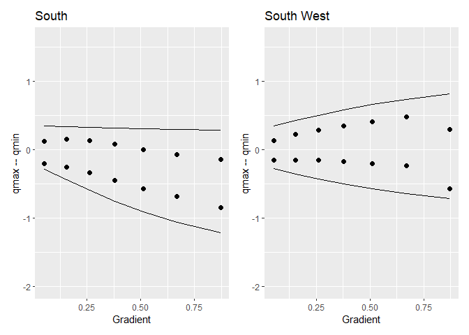
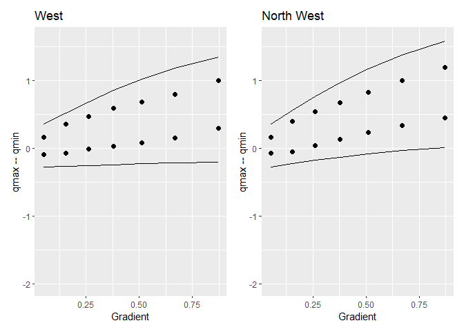
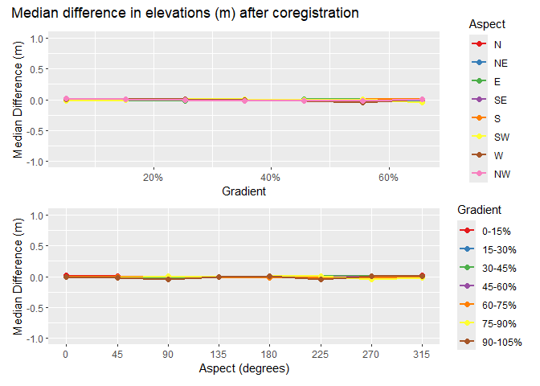

# Coregistration
Dan
2025-03-15

# Introduction

We want to identify landslide sites using changes in ground-surface
elevation resolved between sequential lidar acquisitions. We want to
take advantage of raster-processing algorithms for image segmentation
and topographic analyses, so we would like to work with
elevation-difference rasters. In using lidar to detect elevation change,
it is necessary to ensure that the two data sets are aligned spatially.
Differences in spatial registration between the two data sets will
produce systematic errors in measured elevation differences. In the
study design, we described approaches that have been used for
co-registration of the lidar datasets. These involve two strategies:

- Co-register the ground returns, then build DTMs.

- Co-register existing DTMs.

The first approach seems likely to be the more consistent of the two,
because consistent methods can be used for filtering ground returns from
the point clouds and for interpolation of the DTMs from the ground
returns. When using existing DTMs, e.g., those downloaded from the Lidar
Portal, they may have been generated with different point-filtering
algorithms and interpolation schemes. However, working with point clouds
directly is computationally intensive and time consuming. If we can good
results with the existing DTMs, that will reduce time and computer
requirements dramatically.

Consider two DTMs for the same site, one slightly offset from the other
by an amount $\Delta x, \Delta y, \Delta z$. The elevation difference
between the two DTMs at a grid-point $i$ is $\Delta e_i$. We can write
the elevation difference as

$$
\Delta e_i = \frac{\partial{\Delta e_i}}{\partial{x_i}}\Delta x + \frac{\partial{\Delta e_i}}{\partial{y_i}}\Delta y + \frac{\partial{\Delta e_i}}{\partial{z_i}}\Delta z
 \qquad(1)$$

where $\frac{\partial{\Delta e_i}}{\partial{x_i}}$ is the partial
derivative of the elevation difference with respect to $x_i$, and
similarly for $y_i$ and $z_i$. For $n$ DTM grid points, we then have $n$
equations, each with a unique
$\Delta e_i, \frac{\partial{\Delta e_i}}{\partial{x_i}}$, and
$\frac{\partial{\Delta e_i}}{\partial{y_i}}$
($\frac{\partial{\Delta e_i}}{\partial{z_i}}$ is simply one) and with
single values for each of $\Delta x, \Delta y$, and $\Delta z$. We seek
the $\Delta x, \Delta y$, and $\Delta z$ that provide the best estimates
of all the $\Delta e_i$s. We can treat this as a [linear least-squares
problem](https://en.wikipedia.org/wiki/Linear_least_squares). In matrix
notation, we seek to minimize
$||\boldsymbol{A}\boldsymbol{x} - \boldsymbol{b}||^2$ where
$\boldsymbol{A}$ is a 3 by $n$ matrix containing the partial
derivatives, $\boldsymbol{x}$ is a 3-element vector containing the the
$\Delta x, \Delta y$, and $\Delta z$ values, and $\boldsymbol{b}$ is an
$n$-element array containing the $\Delta e_i$s.

Imagine, on an 80% slope, an offset of 0.5 meters between the two DTMs
would result in a $\Delta e$ of 0.4 meters. The partial derivatives
$\frac{\partial{\Delta e_i}}{\partial{x_i}}$ and
$\frac{\partial{\Delta e_i}}{\partial{y_i}}$ reflect the ground-surface
slope at point $i$ as resolved by the DTM. Each point lies at the corner
of four DTM cells, each cell is defined by four points. For any DTM
point, we can look at the elevations of the adjacent 8 points to
determine into which adjacent cell we need to shift the point to solve
for $\Delta e$. We can estimate the elevation change with a change in x
or y within that cell using bilinear interpolation. That gives a value
for $\frac{\partial{\Delta e_i}}{\partial{x_i}}$ and
$\frac{\partial{\Delta e_i}}{\partial{y_i}}$. The value of
$\frac{\partial{\Delta e_i}}{\partial{z_i}}$ is simply 1.

For any overlapping portion of two DTMs, we can find an optimal set
$\Delta x, \Delta y$, and $\Delta z$. Because the degree of misalignment
between the DTMs may vary spatially, we can seek optimal solutions over
a moving window or for overlapping tiles, although the window or tiles
must be sufficiently large to encompass the full range of slope aspects.

In doing this, we want to exclude portions of the DTMs where elevation
changes did occur. The $\Delta e$s for those sites would not be a
consequence of a shift in the registration between the DTMs and
including those in our set of equations would bias the resulting
estimates for $\Delta x, \Delta y$, and $\Delta z$. Below I describe a
method for differentiating systematic errors and noise from the
elevation changes we want to resolve.

We’ll use a portion of the Post-Mortem study area with overlap of the
2006 and 2007 lidar DTMs that contains several of the study blocks. The
study blocks are shown by the black polygons in the image below. The red
box outlines the analysis area.

Overlap of the two DTMs is shown below with the elevation difference, in
quarter-meter increments, indicated by the colors.

The elevation differences are spatially variable with systematic biases
aligned with hillslope aspect. We can see this by binning the elevation
differences for each DTM grid point by increments in slope and aspect
and plotting [quartiles](https://en.wikipedia.org/wiki/Quartile). To
make the following plots, I first determined the quartiles for the full
range of elevation-difference values in each bin. I want to focus on
systematic errors and noise in the DTMs and exclude sites where
elevations did change, e.g., at landslide sites. To differentiate
between signal (actual elevation changes) and noise, I calculated the
interquartile range for all values, then used a [Tukey
fence](https://en.wikipedia.org/wiki/Outlier#Tukey's_fences) with $k$ =
1.5. Values less that $q1 - (q3-q1)$ or greater than $q3 + (q3-q1)$ are
considered likely [outliers](https://en.wikipedia.org/wiki/Outlier).
These potentially indicate sites where elevations have changed between
lidar acquisitions. For each bin, I removed these potential outliers and
recalculated the quartiles to provide an estimate of the systematic bias
and random error in the elevation-difference values.

The calculations are performed by program align.

Start with systematic errors as indicated by the median value for each
slope and aspect bin.

Figure 1

The median represents the systematic error. It is small for low-gradient
terrain and increases with slope steepness. For south-easterly aspects,
the median error is negative; for north-westerly aspects, the median
error is positive, and for south-west and north-east facing slopes, the
median error remains small. This indicates that the DTMs are shifted in
a south-east to north-west direction relative to each other.

We can use the [interquartile
range](https://en.wikipedia.org/wiki/Interquartile_range) as a measure
of noise in the difference raster.

Figure 2

The interquartile range is relatively small for low-gradient terrain and
increases with slope steepness. This provides a characterization of the
noise in the elevation-difference raster obtained by subtracting the
2017 lidar DTM from the 2006 lidar DTM. Can we use these measurements to
constrain the elevation-threshold that distinguishes signal from noise?
Can we use $qmin = q1 - 1.5*(q3-q1)$ for the minimum $q1$ value as a
function of aspect and slope as a threshold for identifying sites where
elevations decreased between 2006 and 2017? Likewise, can we use
$qmax = q3 + 1.5*(q3-q1)$ for the maximum $q3$ value as a function of
aspect and slope as a threshold for identifying sites where elevations
increased between 2006 and 2017? These values provide slope-dependent
threshold within which we can identify sites where elevations likely did
not change.

Now, can we define a function of slope and aspect that reflects the
behavior observed in the graphs above? For a single aspect, we see that
the median error exhibits a roughly linear dependence with gradient. The
slope of that linear dependence varies with the sine of the aspect. This
agrees with what we expect if the two DTMs are offset horizontally.
Along the fall line, differences in elevation will be maximum; along a
contour, differences will be minimum. So define $$\mu = \sin(A+\alpha)$$

where $A$ is the azimuth measured from north and $\alpha$ is the angular
shift so variation in $\mu$ aligns with that seen in
<a href="#fig-medianErrorBefore" class="quarto-xref">Figure 1</a>. Then
define a linear function of gradient with coefficients that vary with
$\mu$:

$$
qmin = (\beta_0 + \beta_1\mu) + (\beta_2 + \beta_3\mu)*S
$$

where $S$ is slope gradient and the $\beta$s are empirical coefficients.
This defines an equation with five coefficients, $\alpha$ and the four
$\beta$s.

I solve for these coefficients as follows:

1.  Create a normalized set of curves for the variation of $q2$ as a
    function of aspect for each of the slope-gradient increments. The
    “normalized” curves vary from -1 to +1 over the range of aspects.
    The normalization is done as follows:
    1)  For each slope increment, find the maximum and minimum values of
        $q2$.
    2)  Define $qshift = -(qmax-qmin)*0.5$
    3)  Define $range = (qmax-qmin)*0.5$
    4)  Define $normq(abin,sbin) = (q2(abin,sbin) + qshift)/range$
2.  Find the value of $\alpha$ that minimizes the sum of squared
    residuals, i.e., find the value of $\alpha$ that minimizes
    $\sum_{i=1}^n(\sin(A_i+\alpha)-normq_i)^2$. This is done using
    Brent’s algorithm (see
    [people.match.sc.edu/Burkardt/f_src/brent/brent.f90](https://people.math.sc.edu/Burkardt/f_src/brent/brent.f90)).
3.  Define a set of linear equations  
    $$qmin_i = \beta min_0 + \beta min_1*mu_i + \beta min_2*S_i + \beta min_3*mu_i*S_i$$
    $$qmax_i = \beta max_0 + \beta max_1*mu_i + \beta max_2*S_i + \beta max_3*mu_i*S_i$$
    where $\mu_i = \sin(A_i+\alpha)$ and $A_i$ is the slope aspect and
    $S_i$ is slope gradient.
4.  Solve for the $\beta min$s and $\beta max$s. This is done using the
    [LAPACK](https://en.wikipedia.org/wiki/LAPACK) routine DGELS.

Here are the resulting curves for the eight major slope aspects (N, NE,
E, SE, S, SW, W, and NW).

The envelope contained within the $qmin$ and $qmax$ threshold curves
defines the elevation-difference values falling within the range of
gradient- and aspect-dependent systematic errors plus the random errors
(noise) present in the difference raster. We can use these thresholds to
identify sites where there likely were elevation changes during the time
between the lidar acquisitions and exclude these from the set of
equations used to estimate the optimal $\Delta x, \Delta y$, and
$\Delta z$ values. We then use the elevation-difference raster to
estimate the optimal $\Delta x, \Delta y$, and $\Delta z$ values for
each tile or moving window and shift the 2017 DTM to align with the 2006
DTM. Note that these shifts can be spatially variable. We then use the
aligned 2017 DTM to estimate the elevation differences between the two
DTMs.

Here are results after coregistration.

Figure 3

This procedure has essentially removed the systematic differences. Let’s
look at the interquartile range, our measure of random error.

Figure 4

Comparing before and after:

Figure 5

The random errors, as indicated by the interquartile range, have been
slightly reduced. Not what I was expecting. The elevation-difference
raster is now ready for further analysis.

The next step is a spatially distributed quantification of the frequency
distribution of elevation differences, described in Quantiles.
