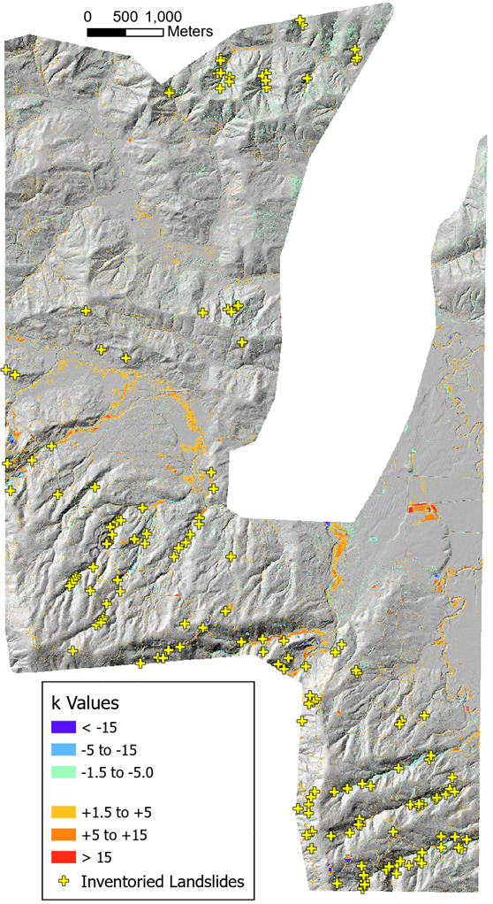
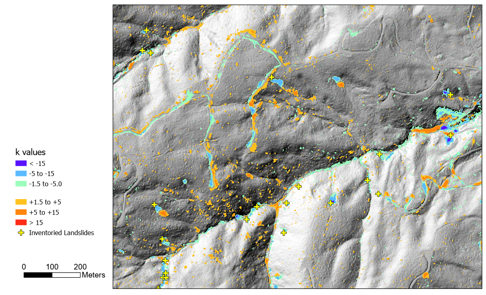
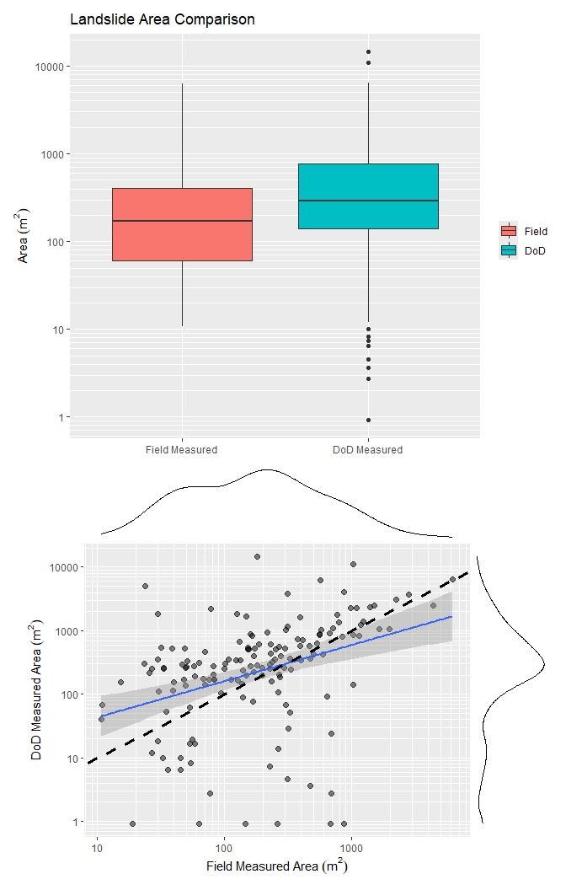
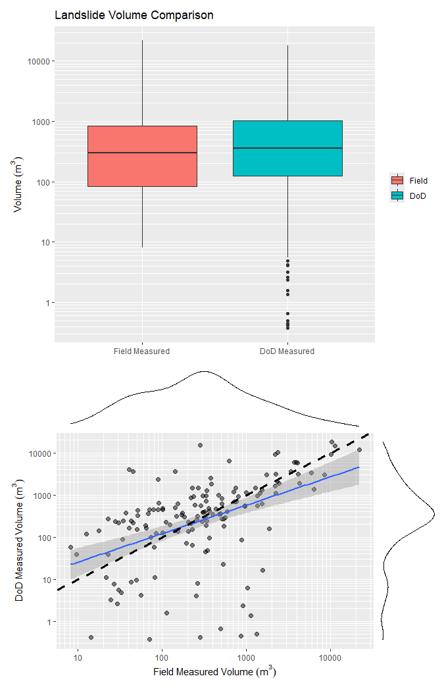
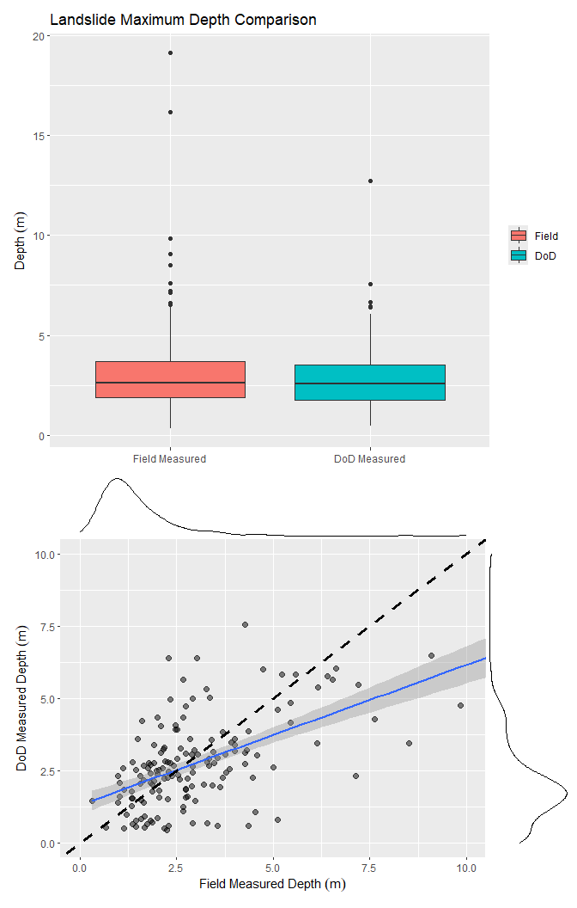
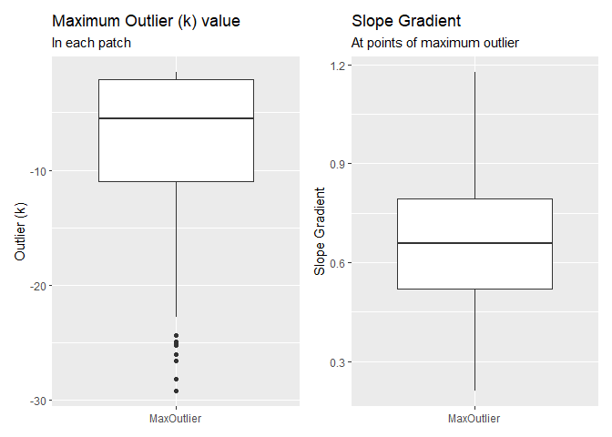
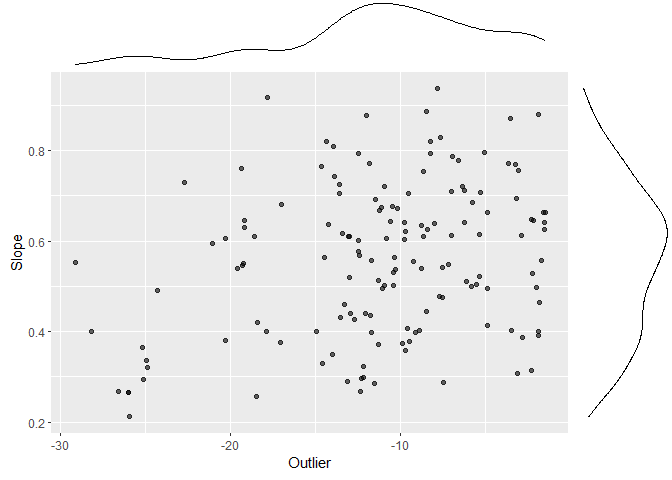

# MappingLandslides
Dan
2025-05-13

## Introduction

In **?@sec-coregistration**, we looked at how the frequency distribution
of elevation differences between two sequential lidar DTMs, after
coregistration, varied with both hillslope gradient and forest-stand
height. We documented these variations using the interquartile range of
elevation-difference values observed over increments of gradient and
stand height. Based on these variations, we defined minimum level of
detection (LoD) for elevation changes using Tukey fences:
<span id="eq-tukeyFence">$$ qmin = q_1 - k*(q_3-q_1); qmax = q_3 + k*(q_3-q_1) \qquad(1)$$</span>
We used a value for $k$ of 1.5 to set the $qmin$ and $qmax$ values to
define the LoD. Note that $q_1$ and $q_3$, and the consequent $qmin$ and
$qmax$, vary spatially with changes in hillslope gradient and stand
height.

Each cell in the DoD (DEM of difference) has an elevation-difference
value $\Delta e$. Expanding on the concept of a Tukey fence, we
calculate a $k$ value as
<span id="eq-k">$$ k = \frac{\Delta e - q_1}{(q_3-q_1)}, \Delta e < q_1 \qquad(2)$$</span>
and $$ k = \frac{\Delta e - q_3}{(q_3-q_1)}, \Delta e > q_3$$ For values
within the interquartile range $(q_1 < \Delta e < q_3)$, $k$ is set to
zero. For elevation loss, $k$ is negative, and for elevation gain, $k$
is positive. This provides a measure of where the value of $\Delta e$ at
each DoD cell lies within the frequency distribution of all $\Delta e$
values. Areas with $k$ values between -1.5 and +1.5 lie inside the LoD
$qmin$ and $qmax$ values and contain most of the DoD area. The
confidence with which we can interpret $\Delta e$ values as actual
changes in elevation and not as random noise or errors increases as the
magnitude of $k$ increases.

## Data

<a href="#fig-kvalues" class="quarto-xref">Figure 1</a> below shows $k$
values outside the LoD envelope for the 2006-2017 lidar overlap in the
Post Mortem study area.

<div id="fig-kvalues">



Figure 1: k values calculated with @eq-k for the 2006-2017 lidar DTM
overlap in the Post Mortem study area.

</div>

Agradation along many low-gradient flood plains is evident from the
yellow to red patches. Blue colors along some of the steeper stream
courses indicate channel incision. Also shown in
<a href="#fig-kvalues" class="quarto-xref">Figure 1</a> are the
field-inventoried landslide locations from the Post Mortem study
(Stewart et al. 2013).
<a href="#fig-zoom" class="quarto-xref">Figure 2</a> below shows the
lower-right portion of the shaded-relief image in
<a href="#fig-kvalues" class="quarto-xref">Figure 1</a>. Zones of
incision (green-blue) and agradation (orange-red) are visible along
stream channels. Landslide scars (blue) and depositional zones
(orange-red) are visible. Some of the excvated road benches and
associated side cast constructed after 2006 also show up. There is also
considerable noise; small blue and orange patches scattered about,
particularly on the steeper slopes.

<div id="fig-zoom">



Figure 2: The lower right portion of @fig-kvalues. The shaded relief is
from 2017.

</div>

We want to see how k-value patches compare with the surveyed landslide
locations. Can we distinguish the landslide signal from the noise? We
implemented the following algorithm:

1.  Identify contiguous patches where k \< -1.5, the gradient is \>
    0.35, and accumulation area is \<
    4000m<sup><sub>2</sub></sup><sub>.</sub>

2.  Find the closest patch to each mapped landslide point within a 30-m
    radius. Exclude patches with an aspect more than 22 degrees
    different than that reported for the landslide.

3.  For each matched patch, extend the patch to include adjacent zones
    with k \< -1.5, but without filtering for gradient. Some patches
    with k \<\< -1.5 included low-gradient zones that appeared to be
    contiguous with and part of the landslide scar.

4.  From the DoD, get the horizontal surface area and volume of each
    patch that is associated with a landslide point.

This algorithm is implemented in Program HuntLS.

``` r
library(TerrainWorksUtils)
library(stringr)

path <- "c:\\work\\data\\postmortem\\"
DEM <- paste0(path, "elev_2006n.flt")
Outlier <- paste0(path, "outlierN0.flt")
DoD <- paste0(path, "difN0.flt")
Accum <- paste0(path, "accum_2006n.flt")
AccumThreshold <- 1000.
LSpnts <- paste0(path, "LS_pnts_N_edited.shp")
IDfield <- "OBJECTID"
Radius <- 30.
AspectLength <- 30.
GradLength <- 10.
OutlierThreshold <- -1.5
ScratchDir <- "c:\\work\\scratch"
OutPatch <- paste0(path, "patch_30")
OutTable <- paste0(path, "table_1")
executable_dir <- "c:\\work\\sandbox\\landslideutilities\\projects\\HuntLS\\x64\\release\\"

if (!file.exists(paste0(OutTable, "_match.csv"))) {
  returnCode <- TerrainWorksUtils::huntLS(DEM,
                                          Outlier,
                                          DoD,
                                          Accum,
                                          AccumThreshold,
                                          LSpnts,
                                          IDfield,
                                          Radius,
                                          AspectLength,
                                          GradLength,
                                          OutlierThreshold,
                                          ScratchDir,
                                          OutPatch,
                                          OutTable,
                                          executable_dir)

  if (returnCode != 0) {
    stop("Error in huntLS")
  }
}
```

HuntLS outputs a raster file of the mapped patches that matched the
inventoried landslides based on proximity and aspect. It also outputs
three comma-delimited (csv) files. The file names are derived from the
“OutTable” variable specified in the (**HuntLS?**) code chunk above. The
suffix distinguishes each file.

1.  OutTable_dist.csv. Each record gives the patch ID, the outlier
    value, and the hillslope gradient for each pixel within all patches
    matched to a surveyed landslide. This table provides the full
    frequency distribution of outlier (k) and gradient values included
    within all the matched patches.

2.  OutTable_match.csv. One record for each matched patch giving the
    dimensions reported for the field-surveyed landslide, the dimensions
    of the patch measured from the DoD, and the largest magnitude
    outlier and slope-gradient values within the patch.

3.  OutTable_nomatch.csv. One record for each surveyed landslide with no
    matching patch. This reports the field-reported dimensions of each
    landslide.

We use these tables to determine the frequency distribution of outlier
and slope-gradient values associated with observed landslides. We hope
to determine the smallest landslide scar that can be resolved with this
DoD using the LoD envelope defined with program Align.

``` r
library(data.table)
library(ggplot2)
library(ggExtra)
library(patchwork)

match <- as.data.table(read.csv(paste0(OutTable, "_match.csv")))
nomatch <- as.data.table(read.csv(paste0(OutTable, "_nomatch.csv")))
n_match <- nrow(match)
n_nomatch <- nrow(nomatch)
```

Of the `{r}n_match+n_nomatch` surveyed landslides, HuntLS matched
`{r}n_match`.
<a href="#fig-compareArea" class="quarto-xref">Figure 3</a> compares the
field-surveyed and DoD-measured landslide scar areas.

``` r
match_long <- melt(match, id.vars = "LSID", 
                   measure.vars = c("LSarea", "Area"),
                   variable.name = "Source",
                   value.name = "Area")
pbox <- ggplot(match_long, aes(x=Source,y=Area, fill=Source)) + 
  geom_boxplot() + 
  scale_y_log10() +
  scale_x_discrete(labels = c("Field Measured", "DoD Measured")) +
  scale_fill_discrete(name = element_blank(), 
                      labels = c("Field", "DoD")) +
  labs(title = "Landslide Area Comparison", 
       x = element_blank(), y = expression(Area~(m^2))) +
  scale_y_log10(minor_breaks=scales::minor_breaks_n(10))

pscat <- ggplot() +
  geom_point(data=match, aes(x=LSarea, y=Area), size=2, alpha=0.5) +
  scale_y_log10() +
  scale_x_log10() +
  labs(x = expression(Field~Measured~Area~(m^2)), 
       y = expression(DoD~Measured~Area~(m^2))) +
  geom_smooth(data=match, aes(x=LSarea, y=Area), method = "lm") +
  geom_abline(slope=1, intercept=0, linetype="dashed", color="black", linewidth=1.2) +
  coord_fixed(ratio=.5) +
  scale_x_log10(minor_breaks=scales::minor_breaks_n(10)) +
  scale_y_log10(minor_breaks=scales::minor_breaks_n(10))
  
pscat <- ggMarginal(pscat)

pcompare <- pbox / pscat
pcompare
```

<div id="fig-compareArea">



Figure 3: Comparison of field-measured and DoD-measured landslide areas.
The boxplot shows the distribution of areas for the two sources. The
scatterplot shows the relationship between the two sources. The solid
blue line is a linear regression fit to the data. The dashed black line
is a 1:1 line. The black lines above and to the right indicate relative
point densities.

</div>

Observed landslide-scar areas span a large range, from
`{r}match[,min(LSarea)]` to `{r}match[,max(LSarea)]` m<sup>2</sup>. The
DoD outlier-patch areas go from a minimum of `{r}match[,min(Area)]` to a
maximum of `{r}match[,max(Area)]` m<sup>2</sup>. The smallest outlier
patches may be under estimated, because the patch extended only to
outlier values of -1.5 or less, not to all DoD values less than zero
contiguous with the patch. In general, the DoD-measured patches tend to
be larger than the field-estimated landslide scar size and larger
outlier patches correspond to larger field-estimated landslide areas,
but with a lot of scatter.
<a href="#fig-compareVolume" class="quarto-xref">Figure 4</a> below
compares the field-surveyed and DoD-measured landslide volumes.

``` r
match_longv <- melt(match, id.vars = "LSID", 
                   measure.vars = c("LSvolume", "Volume"),
                   variable.name = "Source",
                   value.name = "Volume")
pboxv <- ggplot(match_longv, aes(x=Source,y=Volume, fill=Source)) + 
  geom_boxplot() + 
  scale_y_log10() +
  scale_x_discrete(labels = c("Field Measured", "DoD Measured")) +
  scale_fill_discrete(name = element_blank(), 
                      labels = c("Field", "DoD")) +
  labs(title = "Landslide Volume Comparison", 
       x = element_blank(), y = expression(Volume~(m^3))) +
  scale_y_log10(minor_breaks=scales::minor_breaks_n(10))

pscatv <- ggplot() +
  geom_point(data=match, aes(x=LSvolume, y=Volume), size=2, alpha=0.5) +
  scale_y_log10() +
  scale_x_log10() +
  labs(x = expression(Field~Measured~Volume~(m^3)), 
       y = expression(DoD~Measured~Volume~(m^3))) +
  geom_smooth(data=match, aes(x=LSvolume, y=Volume), method = "lm") +
  geom_abline(slope=1, intercept=0, linetype="dashed", color="black", linewidth=1.2) +
  coord_fixed(ratio=.5) +
  scale_x_log10(minor_breaks=scales::minor_breaks_n(10)) +
  scale_y_log10(minor_breaks=scales::minor_breaks_n(10))
  
pscatv <- ggMarginal(pscatv)

pcomparev <- pboxv / pscatv
pcomparev
```

<div id="fig-compareVolume">



Figure 4: Comparison of field-measured and DoD-measured landslide
volumes. The boxplot shows the distribution of volumes for the two
sources. The scatterplot shows the relationship between the two sources.
The solid blue line is a linear regression fit to the data. The dashed
black line is a 1:1 line. The black lines above and to the right
indicate relative point densities.

</div>

The volumes measured from the DoD match the field-estimated volumes a
bit better than the scar areas matched.

``` r
match_longd <- melt(match, id.vars = "LSID", 
                   measure.vars = c("LSmaxDepth", "MaxDepth"),
                   variable.name = "Source",
                   value.name = "MaxDepth")
pboxd <- ggplot(match_longd, aes(x=Source,y=abs(MaxDepth), fill=Source)) + 
  geom_boxplot() + 
  scale_x_discrete(labels = c("Field Measured", "DoD Measured")) +
  scale_fill_discrete(name = element_blank(), 
                      labels = c("Field", "DoD")) +
  labs(title = "Landslide Maximum Depth Comparison", 
       x = element_blank(), y = expression(Depth~(m)))

pscatd <- ggplot() +
  geom_point(data=match, aes(x=LSmaxDepth, y=abs(MaxDepth)), size=2, alpha=0.5) +
  labs(x = expression(Field~Measured~Depth~(m)), 
       y = expression(DoD~Measured~Depth~(m))) +
  geom_smooth(data=match, aes(x=LSmaxDepth, y=abs(MaxDepth)), method = "lm") +
  geom_abline(slope=1, intercept=0, linetype="dashed", color="black", linewidth=1.2) +
  coord_cartesian(x=c(0,10),y=c(0,10)) 

  
pscatd <- ggMarginal(pscatd)

pcompared <- pboxd / pscatd
pcompared
```

<div id="fig-maxDepth">



Figure 5: Comparison of field-measured and DoD-measured maximum scar
depths. The boxplot shows the distribution of depths for the two
sources. The scatterplot shows the relationship between the two sources.
The solid blue line is a linear regression fit to the data. The dashed
black line is a 1:1 line. The black lines above and to the right
indicate relative point densities.

</div>

At least for this case, the frequency distributions of maximum depths
are similar, and there is a general trend for the deeper DoD-measured
depths to correspond to deeper field-measured depths, but with much
scatter.

I am unsure how much concern to place in the scatter in the scatter
plots above. There is some variability between field observers, as
described in (Miskovic and Powell 2009). There is also uncertainty in
the areas and volumes measured from the DoD, which we can account for
when calculating the size of DoD-inventoried landslides.

What about the field-observed landslides that we were unable to resolve
from the DoD?

``` r
nomatch
```

       Record            LSID             RIL     TYPE   LSarea LSvolume LSmaxDepth
        <int>          <char>          <char>    <num>    <num>    <num>     <lgcl>
    1:    417 Inner gorge     Debris flow     83.61274 76.45549   1.5240         NA
    2:   1118                                  0.00000  0.00000   0.0000         NA
    3:   1119                                  0.00000  0.00000   0.0000         NA
    4:    590 Inner gorge     Debris slide    76.64501 23.36140   0.9144         NA
    5:    440 Inner gorge     Debris slide    55.74182 16.99011   0.6096         NA
    6:   1117                                  0.00000  0.00000   0.0000         NA

## Thresholds

It appears that we can use the outlier raster to identify potential
landslide scars. We can use the outlier patches that matched
field-surveyed landslides to characterize the frequency distribution of
outlier and slope gradient values within a landslide patch. Our goal is
to identify threshold values that can be used to filter the patches to
include those most likely to be associated with landslides.

In <a href="#fig-outlierSlope" class="quarto-xref">Figure 6</a> below,
we show the maximum outlier k value for each patch and the slope
gradient at the DoD cell with the maximum

``` r
data <- as.data.table(read.csv(paste0(OutTable, "_outlierSlope.csv")))
# clip out extreme values
data <- data[Outlier > -30 & Slope < 1.2,]
pbox1 <- ggplot(data, aes(x="MaxOutlier", y=Outlier)) + 
  geom_boxplot() +
  theme(legend.position = "inside",
        legend.position.inside = c(0.5, 0.3),
        legend.title = element_blank(),
        axis.title.x = element_blank()) +
  labs(title="Maximum Outlier (k) value",
       subtitle = "In each patch",
       y="Outlier (k)")
pbox2 <- ggplot(data, aes(x="MaxOutlier", y=Slope)) + 
  geom_boxplot() + 
  theme(legend.position = "inside",
        legend.position.inside = c(0.4, 0.8),
        legend.title = element_blank(),
        axis.title.x = element_blank()) +
  labs(title = "Slope Gradient",
       subtitle = "At points of maximum outlier",
       y = "Slope Gradient")
pboxes <- pbox1 + pbox2
pboxes
```

<div id="fig-outlierSlope">



Figure 6

</div>

``` r
pscat <- ggplot(data[Type=="MaxOutlier",], aes(x=Outlier, y=Slope)) + 
  geom_point(size=1.6, alpha=0.6) +
  theme(legend.position = "inside",
        legend.position.inside = c(0.2, 0.8),
        legend.title = element_blank()) 
pscat <- ggMarginal(pscat)
pscat
```



<div id="refs" class="references csl-bib-body hanging-indent"
entry-spacing="0">

<div id="ref-miskovic2009" class="csl-entry">

Miskovic, T., and J. Powell. 2009. “Mass Wasting Prescription-Scale
Effectiveness Monitoring Project (Post-Mortem) Quality Assurance/Quality
Control (QA/QC) Report.”

</div>

<div id="ref-stewart2013" class="csl-entry">

Stewart, Gregory, Julie Dieu, Jeff Phillips, Matt O’Connor, and Curt
Velduisen. 2013. “The Mass Wasting Effectiveness Monitoring Project: An
Examination of the Landslide Response to the December 2007 Storm in
Southwestern Washington.” Olympia, WA.

</div>

</div>
